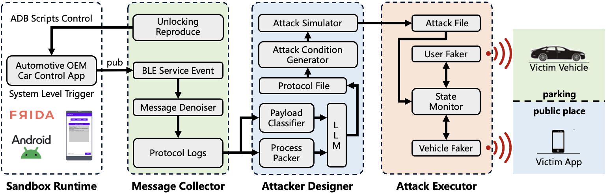
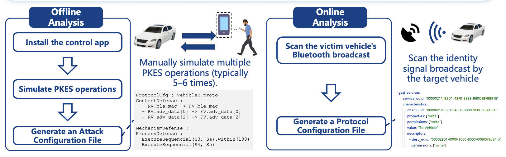
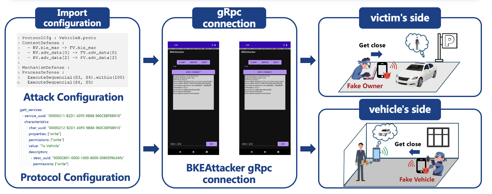
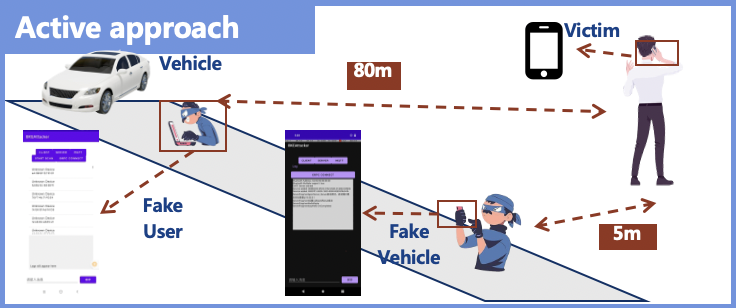
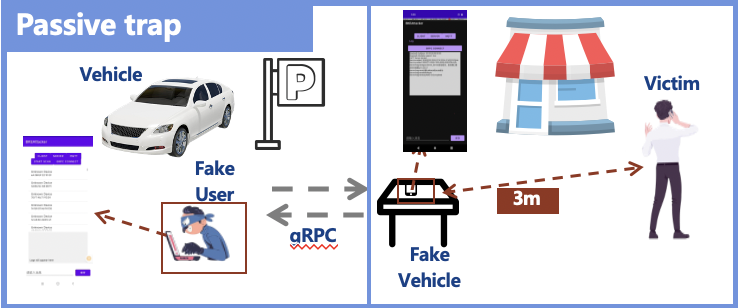

# What is BKEAttacker

Passive keyless entry and start (PKES) systems have become a common target of relay and spoofing attacks. Existing methods, however, suffer from limited range, poor adaptability across brands, and inefficiency due to protocol obfuscation.This paper introduces BKEAttacker , a generalized and automated attack framework for evaluating the security of Bluetooth-based PKES (B-PKES) systems. It reconstructs the underlying protocol logic through a sandbox-based runtime environment, enabling fully automated Man-in-the-Middle (MitM) attacks without prior knowledge of the implementation.
We evaluate BKEAttacker on six major vehicle brands and over 20 models, achieving successful unauthorized unlocking in all cases. In some configurations, remote vehicle ignition was also possible, revealing widespread security weaknesses in commercial B-PKES implementations.

# How does PoltergeistAttack work?

BKEAttacker operates through a structured, four-phase workflow—**Sandbox Runtime**, **Message Collector**, **Attacker Designer**, and **Attack Executor**—enabling systematic and automated security evaluation of B-PKES systems.

1. **Sandbox Runtime**:  
   The workflow begins by executing the vehicle’s official Android application within a sandboxed environment. This module dynamically traces BLE interactions between the app and the system by establishing explicit mappings from application-layer functions to system-level operations. By doing so, it eliminates reliance on traditional reverse engineering techniques and enables protocol reconstruction regardless of code obfuscation or fragmentation.

2. **Message Collector**:  
   While the application runs inside the sandbox, this component monitors key execution paths related to vehicle unlocking and captures all relevant BLE events. These raw logs undergo noise reduction processing to extract clean, protocol-relevant message sequences that serve as input for further analysis.

3. **Attacker Designer**:  
   This phase automates attack generation through two sub-components:
   - **Protocol Analyzer**: Utilizes model-driven methods and large language models (LLMs) to transform raw BLE logs into structured representations of the B-PKES protocol.
   - **Attack Simulator**: Simulates various attack scenarios against the reconstructed protocol to evaluate resistance to MitM attacks and identify exploitable vulnerabilities. Based on this analysis, an *Attack Profile* is generated, encoding the steps required to perform the attack.

4. **Attack Executor**:  
   In the final phase, the Attack Executor loads the generated *Attack Profile* and performs a fully automated Man-in-the-Middle (MitM) attack against the target vehicle. It mimics both the user’s device and the vehicle’s responses to execute unauthorized operations such as remote unlocking and, in some cases, ignition.

This end-to-end workflow allows BKEAttacker to generalize across different automotive brands and B-PKES implementations, overcoming limitations of prior approaches and enabling scalable, automated vulnerability discovery and exploitation.

# Attack Step

The BKEAttacker operates in two main phases: **Protocol Analysis Phase** and **Attack Execution Phase**. Each phase involves both offline and online analysis to effectively understand and exploit the target vehicle's Passive Keyless Entry and Start (PKES) system.

## 1. Protocol Analysis Phase

This phase focuses on understanding the communication protocol and security mechanisms used by the target vehicle brand and model.

### a. Offline Analysis (Sandbox-Based)

Offline Analysis extract common protocol logic and defense mechanisms shared among a specific vehicle series.

**Steps**:
  1. Install the vehicle control app into a sandboxed environment.
  2. Manually simulate multiple PKES operations (typically 5–6 times).
  3. Collect and analyze the execution data.
  4. Generate an **Attack Configuration File** that contains potential attack vectors and timing information.

### b. Online Analysis (Real-Time Scanning)

Online analysis capture real-time broadcast services from the victim vehicle to build a runtime protocol profile.

**Steps**:
  1. Use BKEAttacker to scan the victim vehicle's Bluetooth broadcast
  2. Generate a **Protocol Configuration File** based on observed behavior.

## 2. Attack Execution Phase

Once both configuration files are ready, the attacker proceeds with the actual relay or replay attack using two individuals and a coordinated mobile application setup.

### a. Setup

- Import both the **Attack Configuration File** and the **Protocol Configuration File** into the BKEAttacker App.
- Two attackers are required:
  - **Attacker A**: Stands near the victim (e.g., carrying the legitimate key fob).
  - **Attacker B**: Stands near the target vehicle.

### b. Execution

- The two devices running BKEAttacker establish a secure **gRPC connection** to coordinate the attack in real time.
- The app automates the relay or replay process:
  - Attacker A captures the key fob signal.
  - The captured signal is sent over gRPC to Attacker B.
  - Attacker B forwards the signal to the vehicle to unlock or start it.

This process bypasses the proximity-based security mechanism of the PKES system, enabling unauthorized access.

# Attack scenario

## Active approach

The attacker steals the unlock key by remotely tracking the victim. BKEAttacker poses a certain threat to some vehicle models within a range of 10 meters, and the attack success rate approaches 100% within 5 meters. This physical distance is sufficient for an attacker to find a suitable location to remain hidden while carrying out the attack.

## Passive trap

The attacker waits in a concealed location for the victim to approach. BKEAttacker maintains an attack success rate close to 100% within a range of 3 meters, even in complex BLE communication environments. Victims have difficulty detecting the disguised BKEAttacker within this range in public settings.

# Real-world Attack Evaluation

To evaluate the effectiveness of BKEAttacker in real-world scenarios, we conducted testing across **6 prominent intelligent automotive brands** and over **20 distinct vehicle models** currently on the market. Here are some demo videos.

